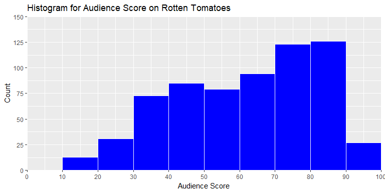
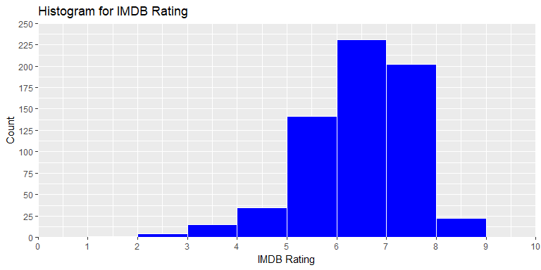
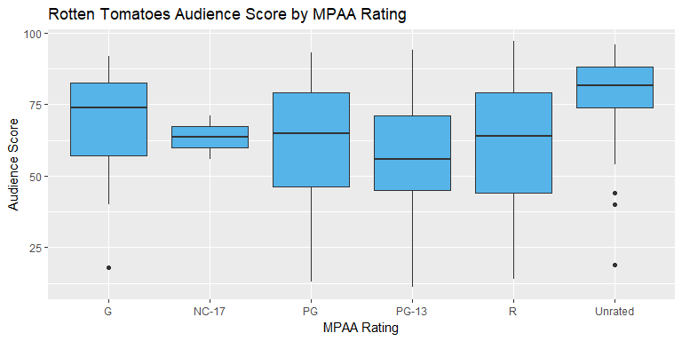
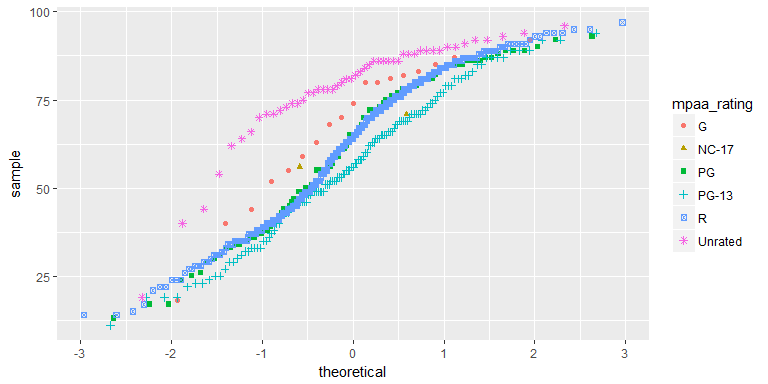
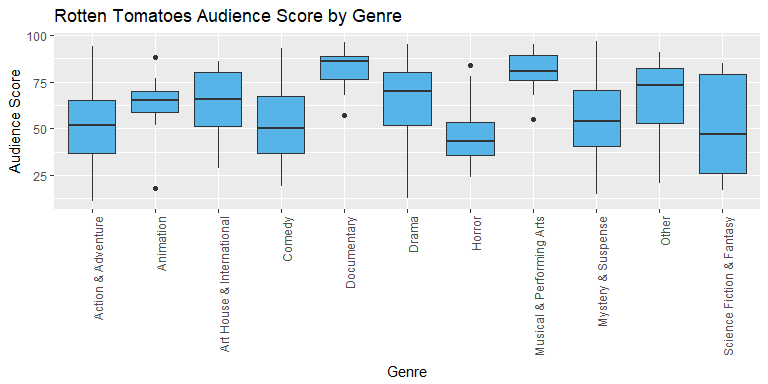
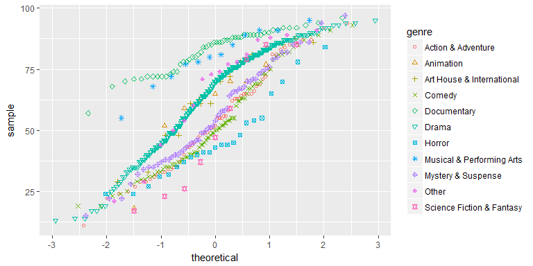

##Synopsis

This analysis performs exploratory data anlaysis and linear regression, modeling, and prediction with a data set of 651 randomly sampled movies. The movie data used in the analysis was sourced from IMDB and Rotten Tomatoes APIs.

## Setup

We will first prepare the workspace environment by setting global options.

### Set Global Options


```r
#Install Knitr pckage if necessary and load Knitr library
list.of.packages <- c("knitr")
new.packages <-
list.of.packages[!(list.of.packages %in% installed.packages()[, "Package"])]
if (length(new.packages))
install.packages(new.packages, repos = "http://cran.us.r-project.org")
suppressWarnings (suppressMessages (library (knitr)))
knitr::opts_chunk$set(
fig.width = 8,
fig.height = 4,
fig.path = 'figures/DataAnalysisProject_',
echo = TRUE,
warning = FALSE,
message = FALSE
)
#Clear variables
rm (list = ls (all = TRUE))
#Get and set working directory
setwd (getwd ())
```

### Load Packages

Install and load required libraries if neccessary.


```r
#Check installed status of requried packages, and install if necessary
list.of.packages <-
  c("statsr", "dplyr", "ggplot2", "scales", "kableExtra")
new.packages <-
  list.of.packages[!(list.of.packages %in% installed.packages()[, "Package"])]
if (length(new.packages))
  install.packages(new.packages, repos = "http://cran.us.r-project.org")
suppressWarnings (suppressMessages (library (statsr)))
suppressWarnings (suppressMessages (library (dplyr)))
suppressWarnings (suppressMessages (library (ggplot2)))
suppressWarnings (suppressMessages (library (scales)))
suppressWarnings (suppressMessages (library (kableExtra)))
```

### Load data

Load the data set.


```r
load ( url ("https://d18ky98rnyall9.cloudfront.net/_e1fe0c85abec6f73c72d73926884eaca_movies.Rdata?Expires=1516752000&Signature=V~IF9fgLNxHP8GsU60bOaOkylphqvSDRSnZQM~A7mrA4qFV7L4UrEHMfOHv4blQM6A9LwV0xBUkKdAcAhUB1NAUsmTNvDoRZ7W2S2MyO-lUyWPCD7zWi9hK98TsB4RXtmpsW1V2x4o-R2TsTTWxtJMbOjFjmotl~0cYotEaGqU0_&Key-Pair-Id=APKAJLTNE6QMUY6HBC5A"))
```


* * *

## Part 1: Data

According to the project's code book, the observations in the "Movies" data set was randomly sampled from IMDB and Rotten Tomatoes APIs. For the sake of the analysis, we will assume the sampling method used was simple random sampling.

Since simple random sampling was used, we know that each population observation has an equal chance of being selected. Thus, we can infer generalizability about the "Movies" data set. Note that we cannot infer causality becase random assignment of the observations was not used.

* * *

## Part 2: Research question

We will research the association and predictive value between the response variable "Audience Score on Rotten Tomatoes," and these explanatory variables:

* Critics score on Rotten Tomatoes
* Critics rating on Rotten Tomatoes (Certified Fresh, Fresh, Rotten)
* MPAA rating of the movie (G, PG, PG-13, R, Unrated)
* Genre of movie (Action & Adventure, Comedy, Documentary, Drama, Horror, Mystery & Suspense, Other)
* Rating on IMDB
* Runtime of movie (in minutes)
* Whether or not the movie was nominated for a best picture Oscar (no, yes)
* Whether or not the movie won a best picture Oscar (no, yes)
* Whether or not one of the main actors in the movie ever won an Oscar (no, yes)
* Whether or not one of the main actresses in the movie ever won an Oscar (no, yes)
* Whether or not the director of the movie ever won an Oscar (no, yes)
* Whether or not the movie is in the Top 200 Box Office list on BoxOfficeMojo (no, yes)

The "Audience score on Rotten Tomatoes" variable as a response is of interest because Rotten Tomatoes is more of a "popularity" score generator based on likes and dislikes, and as percentage score, this metric is easily digested. So, as a very simplified and condensed metric, uncovering any meaningful relationships will be interesting.

The explanatory variables were selected based on understanding different scoring methodologies, and also understanding the influence of perceptual bias, e.g. would a long runtime bore the audience and negatively affect ratings? The remaining variables were not included as they would not lend themselves to modeling. Exclusion details will be included in the "Modeling" section of the analysis.

* * *

## Part 3: Exploratory data analysis

For our Exploratory Data Analysis, let's first get familiar with our response variable, "Audience Score on Rotten Tomatoes," by determining its distribution and summary statistics.

Using a histogram, we will survey the normality.


```r
ggplot(data = movies, aes(movies$audience_score)) +
  geom_histogram(
    breaks = seq(0, 100, by = 10),
    col = "white",
    fill = "blue",
    alpha = 1
  ) +
  scale_x_continuous(
    expand = c(0, 0),
    limits = c(0, 100),
    breaks = seq(0, 100, by = 10)
  ) +
  scale_y_continuous(
    expand = c(0, 0),
    limits = c(0, 150),
    breaks = seq(0, 150, by = 25)
  ) +
  labs(title = "Histogram for Audience Score on Rotten Tomatoes") +
  labs(x = "Audience Score", y = "Count")
```

<!-- -->

There data is slightly skewed to the left, suggesting Rotten Tomatoes reviews tend to be more positive. Let's calculate summary statistics.


```r
#Compute summary stats
AudienceScoreSummary <- movies %>%
select (audience_score) %>%
filter(audience_score != "NA") %>%
summarise (
Total = n (),
MinAudienceScore = min(audience_score, na.rm = TRUE),
MaxAudienceScore = max(audience_score, na.rm = TRUE),
AverageAudienceScore = mean(audience_score, na.rm = TRUE),
MedianAudienceScore = median(audience_score, na.rm = TRUE),
AudienceScoreIQR = IQR(audience_score, na.rm = TRUE)
)

#Create summary table
suppressWarnings (suppressMessages (library (kableExtra)))
AudienceScoreSummary %>%
kable("html") %>%
kable_styling()
```

<table class="table" style="margin-left: auto; margin-right: auto;">
<thead><tr>
<th style="text-align:right;"> Total </th>
   <th style="text-align:right;"> MinAudienceScore </th>
   <th style="text-align:right;"> MaxAudienceScore </th>
   <th style="text-align:right;"> AverageAudienceScore </th>
   <th style="text-align:right;"> MedianAudienceScore </th>
   <th style="text-align:right;"> AudienceScoreIQR </th>
  </tr></thead>
<tbody><tr>
<td style="text-align:right;"> 651 </td>
   <td style="text-align:right;"> 11 </td>
   <td style="text-align:right;"> 97 </td>
   <td style="text-align:right;"> 62.36252 </td>
   <td style="text-align:right;"> 65 </td>
   <td style="text-align:right;"> 34 </td>
  </tr></tbody>
</table>


We see the median score is higher than the mean score, confirming the left skewness. Now, let's compare the distribution of the rating on IMDB to see any potential bias. We will again use a histogram to survey the normality.


```r
ggplot(data = movies, aes(movies$imdb_rating)) +
  geom_histogram(
    breaks = seq(0, 10, by = 1),
    col = "white",
    fill = "blue",
    alpha = 1
  ) +
  scale_x_continuous(
    expand = c(0, 0),
    limits = c(0, 10),
    breaks = seq(0, 10, by = 1)
  ) +
  scale_y_continuous(
    expand = c(0, 0),
    limits = c(0, 250),
    breaks = seq(0, 250, by = 25)
  ) +
  labs(title = "Histogram for IMDB Rating") +
  labs(x = "IMDB Rating", y = "Count")
```

<!-- -->


There data is also slightly skewed to the left, suggesting IMDB ratings tend to be more positive. Let's calculate summary statistics.


```r
#Compute summary stats
IMDBRatingSummary <- movies %>%
  select (imdb_rating) %>%
  filter(imdb_rating != "NA") %>%
  summarise (
  Total = n (),
  MinIMDBRating = min(imdb_rating, na.rm = TRUE),
  MaxIMDBRating = max(imdb_rating, na.rm = TRUE),
  AverageIMDBRating = mean(imdb_rating, na.rm = TRUE),
  MedianIMDBRating = median(imdb_rating, na.rm = TRUE),
  IMDBRatingIQR = IQR(imdb_rating, na.rm = TRUE)
  )

#Create summary table
suppressWarnings (suppressMessages (library (kableExtra)))
IMDBRatingSummary %>%
  kable("html") %>%
  kable_styling()
```

<table class="table" style="margin-left: auto; margin-right: auto;">
<thead><tr>
<th style="text-align:right;"> Total </th>
   <th style="text-align:right;"> MinIMDBRating </th>
   <th style="text-align:right;"> MaxIMDBRating </th>
   <th style="text-align:right;"> AverageIMDBRating </th>
   <th style="text-align:right;"> MedianIMDBRating </th>
   <th style="text-align:right;"> IMDBRatingIQR </th>
  </tr></thead>
<tbody><tr>
<td style="text-align:right;"> 651 </td>
   <td style="text-align:right;"> 1.9 </td>
   <td style="text-align:right;"> 9 </td>
   <td style="text-align:right;"> 6.493088 </td>
   <td style="text-align:right;"> 6.6 </td>
   <td style="text-align:right;"> 1.4 </td>
  </tr></tbody>
</table>


Again, we see the median score is higher than the mean score, confirming the left skewness of the IMDB Ratings. At this point, we want to call out potential bias in the sample and its effects on inference. In other words, the rating inflation can effect our inference results, and subsequent analysis may benefit from a new sample.

However, this bias may disappear in a multi-variate view. Let's breakdown our Rotten Tomatoes Audience Score by MPAA rating.


```r
ggplot(data = subset(movies, !is.na(mpaa_rating) &
                       !is.na(audience_score)),
                       aes(x = mpaa_rating, y = audience_score)) +
                       geom_boxplot(fill = "#56B4E9") +
                       labs(title = "Rotten Tomatoes Audience Score by MPAA Rating", x = "MPAA Rating", y = "Audience Score")
```

<!-- -->

We can see that "Unrated" movies have overwhelmingly positive reviews with little variation, and PG-13 movies have the lowest median score with much variability. To getter more detailed view of skewness, let's look at a quantile-quantile plot.


```r
qplot(
  sample = audience_score,
  data = subset(movies,!is.na(mpaa_rating) &
                  !is.na(audience_score)),
  color = mpaa_rating,
  shape = mpaa_rating
)
```

<!-- -->

Left-skewness is definitive except for the PG-13 rating. Let's see what the summary statistics say.


```r
#Compute summary stats
AudienceScoreSummaryMPAA <- movies %>%
  select (mpaa_rating, audience_score) %>%
  filter(audience_score != "NA") %>%
  group_by (mpaa_rating) %>%
  summarise (
    Total = n (),
    MinAudienceScore = min(audience_score, na.rm = TRUE),
    MaxAudienceScore = max(audience_score, na.rm = TRUE),
    AverageAudienceScore = mean(audience_score, na.rm = TRUE),
    MedianAudienceScore = median(audience_score, na.rm = TRUE),
    AudienceScoreIQR = IQR(audience_score, na.rm = TRUE)
  ) %>%
  arrange (desc(AverageAudienceScore))

#Create summary table
suppressWarnings (suppressMessages (library (kableExtra)))
AudienceScoreSummaryMPAA %>%
  kable("html") %>%
  kable_styling()
```

<table class="table" style="margin-left: auto; margin-right: auto;">
<thead><tr>
<th style="text-align:left;"> mpaa_rating </th>
   <th style="text-align:right;"> Total </th>
   <th style="text-align:right;"> MinAudienceScore </th>
   <th style="text-align:right;"> MaxAudienceScore </th>
   <th style="text-align:right;"> AverageAudienceScore </th>
   <th style="text-align:right;"> MedianAudienceScore </th>
   <th style="text-align:right;"> AudienceScoreIQR </th>
  </tr></thead>
<tbody>
<tr>
<td style="text-align:left;"> Unrated </td>
   <td style="text-align:right;"> 50 </td>
   <td style="text-align:right;"> 19 </td>
   <td style="text-align:right;"> 96 </td>
   <td style="text-align:right;"> 78.48000 </td>
   <td style="text-align:right;"> 81.5 </td>
   <td style="text-align:right;"> 14.00 </td>
  </tr>
<tr>
<td style="text-align:left;"> G </td>
   <td style="text-align:right;"> 19 </td>
   <td style="text-align:right;"> 18 </td>
   <td style="text-align:right;"> 92 </td>
   <td style="text-align:right;"> 68.47368 </td>
   <td style="text-align:right;"> 74.0 </td>
   <td style="text-align:right;"> 25.50 </td>
  </tr>
<tr>
<td style="text-align:left;"> NC-17 </td>
   <td style="text-align:right;"> 2 </td>
   <td style="text-align:right;"> 56 </td>
   <td style="text-align:right;"> 71 </td>
   <td style="text-align:right;"> 63.50000 </td>
   <td style="text-align:right;"> 63.5 </td>
   <td style="text-align:right;"> 7.50 </td>
  </tr>
<tr>
<td style="text-align:left;"> R </td>
   <td style="text-align:right;"> 329 </td>
   <td style="text-align:right;"> 14 </td>
   <td style="text-align:right;"> 97 </td>
   <td style="text-align:right;"> 62.04255 </td>
   <td style="text-align:right;"> 64.0 </td>
   <td style="text-align:right;"> 35.00 </td>
  </tr>
<tr>
<td style="text-align:left;"> PG </td>
   <td style="text-align:right;"> 118 </td>
   <td style="text-align:right;"> 13 </td>
   <td style="text-align:right;"> 93 </td>
   <td style="text-align:right;"> 61.83051 </td>
   <td style="text-align:right;"> 65.0 </td>
   <td style="text-align:right;"> 32.75 </td>
  </tr>
<tr>
<td style="text-align:left;"> PG-13 </td>
   <td style="text-align:right;"> 133 </td>
   <td style="text-align:right;"> 11 </td>
   <td style="text-align:right;"> 94 </td>
   <td style="text-align:right;"> 56.67669 </td>
   <td style="text-align:right;"> 56.0 </td>
   <td style="text-align:right;"> 26.00 </td>
  </tr>
</tbody>
</table>

We can conclude that left-skenewness is pervasive for almost all of the MPAA ratings except the normally distributed PG-13 rating.

As an additional angle on multi-variate analysis of skewness, we will look at the movie genre and repeat our set of visuals and summary stats.


```r
ggplot(data = subset(movies,!is.na(genre) &
                       !is.na(audience_score)),
                       aes(x = genre, y = audience_score)) +
                       geom_boxplot(fill = "#56B4E9") +
                       labs(title = "Rotten Tomatoes Audience Score by Genre", x = "Genre", y = "Audience Score") +
                       theme(axis.text.x = element_text(angle = 90, hjust = 1))
```

<!-- -->

Genre variability is incredibly diverse. We can see that a movie's rating is definitely affected by its genre, where documentaries fare much better than action movies. This revelation begs the question of significance between genres. Let's look at the quantile-quantile plot.


```r
p <- qplot(
  sample = audience_score,
  data = subset(movies, !is.na(genre) &
  !is.na(audience_score)),
  color = genre,
  shape = genre
  )
  p + scale_shape_manual(values = c(1, 2, 3, 4, 5, 6, 7, 8, 9, 10, 11))
```

<!-- -->

The "Documentary" and "Musical & Performing Arts" genres are notable examples of left-skew. Now for the summary stats.


```r
#Compute summary stats
AudienceScoreSummaryGenre <- movies %>%
  select (genre, audience_score) %>%
  filter(audience_score != "NA") %>%
  group_by (genre) %>%
  summarise (
    Total = n (),
    MinAudienceScore = min(audience_score, na.rm = TRUE),
    MaxAudienceScore = max(audience_score, na.rm = TRUE),
    AverageAudienceScore = mean(audience_score, na.rm = TRUE),
    MedianAudienceScore = median(audience_score, na.rm = TRUE),
    AudienceScoreIQR = IQR(audience_score, na.rm = TRUE)
  ) %>%
  arrange (desc(AverageAudienceScore))

#Create summary table
suppressWarnings (suppressMessages (library (kableExtra)))
AudienceScoreSummaryGenre %>%
  kable("html") %>%
  kable_styling()
```

<table class="table" style="margin-left: auto; margin-right: auto;">
<thead><tr>
<th style="text-align:left;"> genre </th>
   <th style="text-align:right;"> Total </th>
   <th style="text-align:right;"> MinAudienceScore </th>
   <th style="text-align:right;"> MaxAudienceScore </th>
   <th style="text-align:right;"> AverageAudienceScore </th>
   <th style="text-align:right;"> MedianAudienceScore </th>
   <th style="text-align:right;"> AudienceScoreIQR </th>
  </tr></thead>
<tbody>
<tr>
<td style="text-align:left;"> Documentary </td>
   <td style="text-align:right;"> 52 </td>
   <td style="text-align:right;"> 57 </td>
   <td style="text-align:right;"> 96 </td>
   <td style="text-align:right;"> 82.75000 </td>
   <td style="text-align:right;"> 86.0 </td>
   <td style="text-align:right;"> 12.75 </td>
  </tr>
<tr>
<td style="text-align:left;"> Musical &amp; Performing Arts </td>
   <td style="text-align:right;"> 12 </td>
   <td style="text-align:right;"> 55 </td>
   <td style="text-align:right;"> 95 </td>
   <td style="text-align:right;"> 80.16667 </td>
   <td style="text-align:right;"> 80.5 </td>
   <td style="text-align:right;"> 13.75 </td>
  </tr>
<tr>
<td style="text-align:left;"> Other </td>
   <td style="text-align:right;"> 16 </td>
   <td style="text-align:right;"> 21 </td>
   <td style="text-align:right;"> 91 </td>
   <td style="text-align:right;"> 66.68750 </td>
   <td style="text-align:right;"> 73.5 </td>
   <td style="text-align:right;"> 29.50 </td>
  </tr>
<tr>
<td style="text-align:left;"> Drama </td>
   <td style="text-align:right;"> 305 </td>
   <td style="text-align:right;"> 13 </td>
   <td style="text-align:right;"> 95 </td>
   <td style="text-align:right;"> 65.34754 </td>
   <td style="text-align:right;"> 70.0 </td>
   <td style="text-align:right;"> 28.00 </td>
  </tr>
<tr>
<td style="text-align:left;"> Art House &amp; International </td>
   <td style="text-align:right;"> 14 </td>
   <td style="text-align:right;"> 29 </td>
   <td style="text-align:right;"> 86 </td>
   <td style="text-align:right;"> 64.00000 </td>
   <td style="text-align:right;"> 65.5 </td>
   <td style="text-align:right;"> 29.00 </td>
  </tr>
<tr>
<td style="text-align:left;"> Animation </td>
   <td style="text-align:right;"> 9 </td>
   <td style="text-align:right;"> 18 </td>
   <td style="text-align:right;"> 88 </td>
   <td style="text-align:right;"> 62.44444 </td>
   <td style="text-align:right;"> 65.0 </td>
   <td style="text-align:right;"> 11.00 </td>
  </tr>
<tr>
<td style="text-align:left;"> Mystery &amp; Suspense </td>
   <td style="text-align:right;"> 59 </td>
   <td style="text-align:right;"> 15 </td>
   <td style="text-align:right;"> 97 </td>
   <td style="text-align:right;"> 55.94915 </td>
   <td style="text-align:right;"> 54.0 </td>
   <td style="text-align:right;"> 30.00 </td>
  </tr>
<tr>
<td style="text-align:left;"> Action &amp; Adventure </td>
   <td style="text-align:right;"> 65 </td>
   <td style="text-align:right;"> 11 </td>
   <td style="text-align:right;"> 94 </td>
   <td style="text-align:right;"> 53.78462 </td>
   <td style="text-align:right;"> 52.0 </td>
   <td style="text-align:right;"> 28.00 </td>
  </tr>
<tr>
<td style="text-align:left;"> Comedy </td>
   <td style="text-align:right;"> 87 </td>
   <td style="text-align:right;"> 19 </td>
   <td style="text-align:right;"> 93 </td>
   <td style="text-align:right;"> 52.50575 </td>
   <td style="text-align:right;"> 50.0 </td>
   <td style="text-align:right;"> 30.50 </td>
  </tr>
<tr>
<td style="text-align:left;"> Science Fiction &amp; Fantasy </td>
   <td style="text-align:right;"> 9 </td>
   <td style="text-align:right;"> 17 </td>
   <td style="text-align:right;"> 85 </td>
   <td style="text-align:right;"> 50.88889 </td>
   <td style="text-align:right;"> 47.0 </td>
   <td style="text-align:right;"> 53.00 </td>
  </tr>
<tr>
<td style="text-align:left;"> Horror </td>
   <td style="text-align:right;"> 23 </td>
   <td style="text-align:right;"> 24 </td>
   <td style="text-align:right;"> 84 </td>
   <td style="text-align:right;"> 45.82609 </td>
   <td style="text-align:right;"> 43.0 </td>
   <td style="text-align:right;"> 17.50 </td>
  </tr>
</tbody>
</table>


* * *

## Part 4: Modeling

NOTE: Insert code chunks as needed by clicking on the "Insert a new code chunk" 
button above. Make sure that your code is visible in the project you submit. 
Delete this note when before you submit your work.

* * *

## Part 5: Prediction

NOTE: Insert code chunks as needed by clicking on the "Insert a new code chunk" 
button above. Make sure that your code is visible in the project you submit. 
Delete this note when before you submit your work.

* * *

## Part 6: Conclusion

