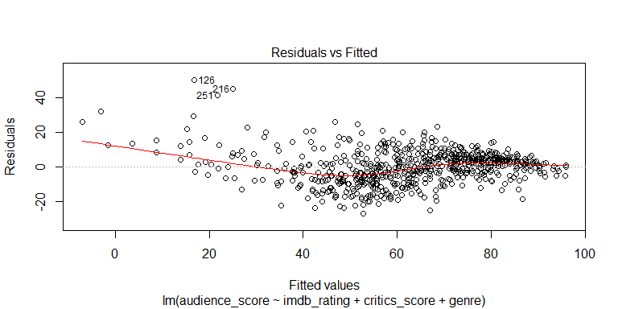
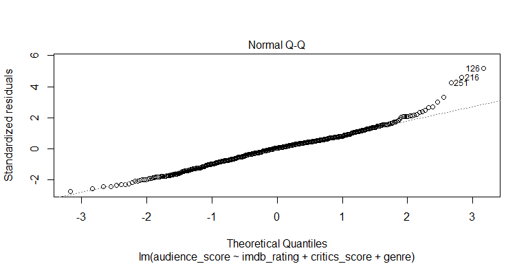
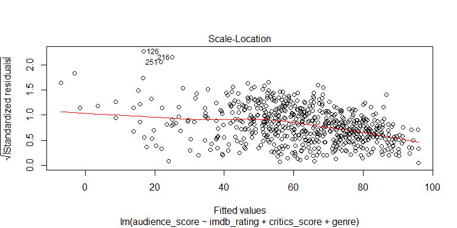
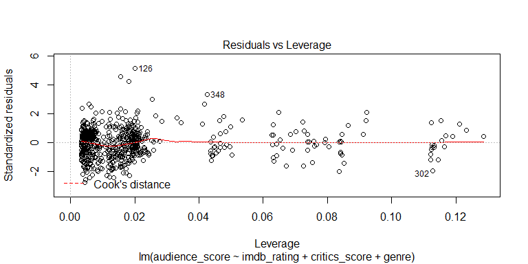

##Synopsis

This analysis performs exploratory data anlaysis and linear regression, modeling, and prediction with a data set of 651 randomly sampled movies. The movie data used in the analysis was sourced from IMDB and Rotten Tomatoes APIs.

## Setup

We will first prepare the workspace environment by setting global options.

### Set Global Options


```r
#Install Knitr pckage if necessary and load Knitr library
list.of.packages <- c("knitr")
new.packages <-
list.of.packages[!(list.of.packages %in% installed.packages()[, "Package"])]
if (length(new.packages))
install.packages(new.packages, repos = "http://cran.us.r-project.org")
suppressWarnings (suppressMessages (library (knitr)))
knitr::opts_chunk$set(
fig.width = 8,
fig.height = 4,
fig.path = 'figures/DataAnalysisProject_',
echo = TRUE,
warning = FALSE,
message = FALSE
)
#Clear variables
rm (list = ls (all = TRUE))
#Get and set working directory
setwd (getwd ())
```

### Load Packages

Install and load required libraries if neccessary.


```r
#Check installed status of requried packages, and install if necessary
list.of.packages <-
  c("statsr", "dplyr", "ggplot2", "scales", "kableExtra", "olsrr", "lmtest", "car")
new.packages <-
  list.of.packages[!(list.of.packages %in% installed.packages()[, "Package"])]
if (length(new.packages))
  install.packages(new.packages, repos = "http://cran.us.r-project.org")
suppressWarnings (suppressMessages (library (statsr)))
suppressWarnings (suppressMessages (library (dplyr)))
suppressWarnings (suppressMessages (library (ggplot2)))
suppressWarnings (suppressMessages (library (scales)))
suppressWarnings (suppressMessages (library (kableExtra)))
suppressWarnings (suppressMessages (library (olsrr)))
suppressWarnings (suppressMessages (library (lmtest)))
suppressWarnings (suppressMessages (library (car)))
```

### Load data

Load the data set.


```r
load ( url ("https://d18ky98rnyall9.cloudfront.net/_e1fe0c85abec6f73c72d73926884eaca_movies.Rdata?Expires=1516752000&Signature=V~IF9fgLNxHP8GsU60bOaOkylphqvSDRSnZQM~A7mrA4qFV7L4UrEHMfOHv4blQM6A9LwV0xBUkKdAcAhUB1NAUsmTNvDoRZ7W2S2MyO-lUyWPCD7zWi9hK98TsB4RXtmpsW1V2x4o-R2TsTTWxtJMbOjFjmotl~0cYotEaGqU0_&Key-Pair-Id=APKAJLTNE6QMUY6HBC5A"))
```


* * *

## Part 1: Data

According to the project's code book, the observations in the "Movies" data set was randomly sampled from IMDB and Rotten Tomatoes APIs. For the sake of the analysis, we will assume the sampling method used was simple random sampling.

Since simple random sampling was used, we know that each population observation has an equal chance of being selected. Thus, we can infer generalizability about the "Movies" data set. Note that we cannot infer causality becase random assignment of the observations was not used.

* * *

## Part 2: Research question

We will research the association and predictive value between the response variable "Audience Score on Rotten Tomatoes," and multiple explanatory variables to build a multiple linear regression model. Variable selection criteria will be covered in Part 4: Modeling. Note the explanatory variables used in the model were selected based on their contextual relevance.

The "Audience score on Rotten Tomatoes" variable as a response is of interest because Rotten Tomatoes is more of a "popularity" score generator based on likes and dislikes, and as percentage score, this metric is easily digested. So, as a very simplified and condensed metric, uncovering any meaningful relationships will be interesting.


* * *

## Part 3: Exploratory data analysis

For our Exploratory Data Analysis, let's first get familiar with our response variable, "Audience Score on Rotten Tomatoes," by determining its distribution and summary statistics.

Using a histogram, we will survey the normality.


```r
ggplot(data = movies, aes(movies$audience_score)) +
  geom_histogram(
    breaks = seq(0, 100, by = 10),
    col = "white",
    fill = "blue",
    alpha = 1
  ) +
  scale_x_continuous(
    expand = c(0, 0),
    limits = c(0, 100),
    breaks = seq(0, 100, by = 10)
  ) +
  scale_y_continuous(
    expand = c(0, 0),
    limits = c(0, 150),
    breaks = seq(0, 150, by = 25)
  ) +
  labs(title = "Histogram for Audience Score on Rotten Tomatoes") +
  labs(x = "Audience Score", y = "Count")
```

<!-- -->

There data is slightly skewed to the left, suggesting Rotten Tomatoes reviews tend to be more positive. Let's calculate summary statistics.


```r
#Compute summary stats
AudienceScoreSummary <- movies %>%
select (audience_score) %>%
filter(audience_score != "NA") %>%
summarise (
Total = n (),
MinAudienceScore = min(audience_score, na.rm = TRUE),
MaxAudienceScore = max(audience_score, na.rm = TRUE),
AverageAudienceScore = mean(audience_score, na.rm = TRUE),
MedianAudienceScore = median(audience_score, na.rm = TRUE),
AudienceScoreIQR = IQR(audience_score, na.rm = TRUE)
)

#Create summary table
suppressWarnings (suppressMessages (library (kableExtra)))
AudienceScoreSummary %>%
kable("html") %>%
kable_styling()
```

<table class="table" style="margin-left: auto; margin-right: auto;">
<thead><tr>
<th style="text-align:right;"> Total </th>
   <th style="text-align:right;"> MinAudienceScore </th>
   <th style="text-align:right;"> MaxAudienceScore </th>
   <th style="text-align:right;"> AverageAudienceScore </th>
   <th style="text-align:right;"> MedianAudienceScore </th>
   <th style="text-align:right;"> AudienceScoreIQR </th>
  </tr></thead>
<tbody><tr>
<td style="text-align:right;"> 651 </td>
   <td style="text-align:right;"> 11 </td>
   <td style="text-align:right;"> 97 </td>
   <td style="text-align:right;"> 62.36252 </td>
   <td style="text-align:right;"> 65 </td>
   <td style="text-align:right;"> 34 </td>
  </tr></tbody>
</table>


We see the median score is higher than the mean score, confirming the left skewness. Now, let's compare the distribution of the rating on IMDB to see any potential bias. We will again use a histogram to survey the normality.


```r
ggplot(data = movies, aes(movies$imdb_rating)) +
  geom_histogram(
    breaks = seq(0, 10, by = 1),
    col = "white",
    fill = "blue",
    alpha = 1
  ) +
  scale_x_continuous(
    expand = c(0, 0),
    limits = c(0, 10),
    breaks = seq(0, 10, by = 1)
  ) +
  scale_y_continuous(
    expand = c(0, 0),
    limits = c(0, 250),
    breaks = seq(0, 250, by = 25)
  ) +
  labs(title = "Histogram for IMDB Rating") +
  labs(x = "IMDB Rating", y = "Count")
```

<!-- -->


There data is also slightly skewed to the left, suggesting IMDB ratings tend to be more positive. Let's calculate summary statistics.


```r
#Compute summary stats
IMDBRatingSummary <- movies %>%
  select (imdb_rating) %>%
  filter(imdb_rating != "NA") %>%
  summarise (
  Total = n (),
  MinIMDBRating = min(imdb_rating, na.rm = TRUE),
  MaxIMDBRating = max(imdb_rating, na.rm = TRUE),
  AverageIMDBRating = mean(imdb_rating, na.rm = TRUE),
  MedianIMDBRating = median(imdb_rating, na.rm = TRUE),
  IMDBRatingIQR = IQR(imdb_rating, na.rm = TRUE)
  )

#Create summary table
suppressWarnings (suppressMessages (library (kableExtra)))
IMDBRatingSummary %>%
  kable("html") %>%
  kable_styling()
```

<table class="table" style="margin-left: auto; margin-right: auto;">
<thead><tr>
<th style="text-align:right;"> Total </th>
   <th style="text-align:right;"> MinIMDBRating </th>
   <th style="text-align:right;"> MaxIMDBRating </th>
   <th style="text-align:right;"> AverageIMDBRating </th>
   <th style="text-align:right;"> MedianIMDBRating </th>
   <th style="text-align:right;"> IMDBRatingIQR </th>
  </tr></thead>
<tbody><tr>
<td style="text-align:right;"> 651 </td>
   <td style="text-align:right;"> 1.9 </td>
   <td style="text-align:right;"> 9 </td>
   <td style="text-align:right;"> 6.493088 </td>
   <td style="text-align:right;"> 6.6 </td>
   <td style="text-align:right;"> 1.4 </td>
  </tr></tbody>
</table>


Again, we see the median score is higher than the mean score, confirming the left skewness of the IMDB Ratings. At this point, we want to call out potential bias in the sample and its effects on inference. In other words, the rating inflation can effect our inference results, and subsequent analysis may benefit from a new sample.

However, this bias may disappear in a multi-variate view. Let's breakdown our Rotten Tomatoes Audience Score by MPAA rating.


```r
ggplot(data = subset(movies, !is.na(mpaa_rating) &
                       !is.na(audience_score)),
                       aes(x = mpaa_rating, y = audience_score)) +
                       geom_boxplot(fill = "#56B4E9") +
                       labs(title = "Rotten Tomatoes Audience Score by MPAA Rating", x = "MPAA Rating", y = "Audience Score")
```

<!-- -->

We can see that "Unrated" movies have overwhelmingly positive reviews with little variation, and PG-13 movies have the lowest median score with much variability. To getter more detailed view of skewness, let's look at a quantile-quantile plot.


```r
qplot(
  sample = audience_score,
  data = subset(movies,!is.na(mpaa_rating) &
                  !is.na(audience_score)),
  color = mpaa_rating,
  shape = mpaa_rating
)
```

<!-- -->

Left-skewness is definitive except for the PG-13 rating. Let's see what the summary statistics say.


```r
#Compute summary stats
AudienceScoreSummaryMPAA <- movies %>%
  select (mpaa_rating, audience_score) %>%
  filter(audience_score != "NA") %>%
  group_by (mpaa_rating) %>%
  summarise (
    Total = n (),
    MinAudienceScore = min(audience_score, na.rm = TRUE),
    MaxAudienceScore = max(audience_score, na.rm = TRUE),
    AverageAudienceScore = mean(audience_score, na.rm = TRUE),
    MedianAudienceScore = median(audience_score, na.rm = TRUE),
    AudienceScoreIQR = IQR(audience_score, na.rm = TRUE)
  ) %>%
  arrange (desc(AverageAudienceScore))

#Create summary table
suppressWarnings (suppressMessages (library (kableExtra)))
AudienceScoreSummaryMPAA %>%
  kable("html") %>%
  kable_styling()
```

<table class="table" style="margin-left: auto; margin-right: auto;">
<thead><tr>
<th style="text-align:left;"> mpaa_rating </th>
   <th style="text-align:right;"> Total </th>
   <th style="text-align:right;"> MinAudienceScore </th>
   <th style="text-align:right;"> MaxAudienceScore </th>
   <th style="text-align:right;"> AverageAudienceScore </th>
   <th style="text-align:right;"> MedianAudienceScore </th>
   <th style="text-align:right;"> AudienceScoreIQR </th>
  </tr></thead>
<tbody>
<tr>
<td style="text-align:left;"> Unrated </td>
   <td style="text-align:right;"> 50 </td>
   <td style="text-align:right;"> 19 </td>
   <td style="text-align:right;"> 96 </td>
   <td style="text-align:right;"> 78.48000 </td>
   <td style="text-align:right;"> 81.5 </td>
   <td style="text-align:right;"> 14.00 </td>
  </tr>
<tr>
<td style="text-align:left;"> G </td>
   <td style="text-align:right;"> 19 </td>
   <td style="text-align:right;"> 18 </td>
   <td style="text-align:right;"> 92 </td>
   <td style="text-align:right;"> 68.47368 </td>
   <td style="text-align:right;"> 74.0 </td>
   <td style="text-align:right;"> 25.50 </td>
  </tr>
<tr>
<td style="text-align:left;"> NC-17 </td>
   <td style="text-align:right;"> 2 </td>
   <td style="text-align:right;"> 56 </td>
   <td style="text-align:right;"> 71 </td>
   <td style="text-align:right;"> 63.50000 </td>
   <td style="text-align:right;"> 63.5 </td>
   <td style="text-align:right;"> 7.50 </td>
  </tr>
<tr>
<td style="text-align:left;"> R </td>
   <td style="text-align:right;"> 329 </td>
   <td style="text-align:right;"> 14 </td>
   <td style="text-align:right;"> 97 </td>
   <td style="text-align:right;"> 62.04255 </td>
   <td style="text-align:right;"> 64.0 </td>
   <td style="text-align:right;"> 35.00 </td>
  </tr>
<tr>
<td style="text-align:left;"> PG </td>
   <td style="text-align:right;"> 118 </td>
   <td style="text-align:right;"> 13 </td>
   <td style="text-align:right;"> 93 </td>
   <td style="text-align:right;"> 61.83051 </td>
   <td style="text-align:right;"> 65.0 </td>
   <td style="text-align:right;"> 32.75 </td>
  </tr>
<tr>
<td style="text-align:left;"> PG-13 </td>
   <td style="text-align:right;"> 133 </td>
   <td style="text-align:right;"> 11 </td>
   <td style="text-align:right;"> 94 </td>
   <td style="text-align:right;"> 56.67669 </td>
   <td style="text-align:right;"> 56.0 </td>
   <td style="text-align:right;"> 26.00 </td>
  </tr>
</tbody>
</table>

We can conclude that left-skenewness is pervasive for almost all of the MPAA ratings except the normally distributed PG-13 rating.

As an additional angle on multi-variate analysis of skewness, we will look at the movie genre and repeat our set of visuals and summary stats.


```r
ggplot(data = subset(movies,!is.na(genre) &
                       !is.na(audience_score)),
                       aes(x = genre, y = audience_score)) +
                       geom_boxplot(fill = "#56B4E9") +
                       labs(title = "Rotten Tomatoes Audience Score by Genre", x = "Genre", y = "Audience Score") +
                       theme(axis.text.x = element_text(angle = 90, hjust = 1))
```

<!-- -->

Genre variability is incredibly diverse. We can see that a movie's rating is definitely affected by its genre, where documentaries fare much better than action movies. This revelation begs the question of significance between genres. Let's look at the quantile-quantile plot.


```r
p <- qplot(
  sample = audience_score,
  data = subset(movies, !is.na(genre) &
  !is.na(audience_score)),
  color = genre,
  shape = genre
  )
  p + scale_shape_manual(values = c(1, 2, 3, 4, 5, 6, 7, 8, 9, 10, 11))
```

<!-- -->

The "Documentary" and "Musical & Performing Arts" genres are notable examples of left-skew. Now for the summary stats.


```r
#Compute summary stats
AudienceScoreSummaryGenre <- movies %>%
  select (genre, audience_score) %>%
  filter(audience_score != "NA") %>%
  group_by (genre) %>%
  summarise (
    Total = n (),
    MinAudienceScore = min(audience_score, na.rm = TRUE),
    MaxAudienceScore = max(audience_score, na.rm = TRUE),
    AverageAudienceScore = mean(audience_score, na.rm = TRUE),
    MedianAudienceScore = median(audience_score, na.rm = TRUE),
    AudienceScoreIQR = IQR(audience_score, na.rm = TRUE)
  ) %>%
  arrange (desc(AverageAudienceScore))

#Create summary table
suppressWarnings (suppressMessages (library (kableExtra)))
AudienceScoreSummaryGenre %>%
  kable("html") %>%
  kable_styling()
```

<table class="table" style="margin-left: auto; margin-right: auto;">
<thead><tr>
<th style="text-align:left;"> genre </th>
   <th style="text-align:right;"> Total </th>
   <th style="text-align:right;"> MinAudienceScore </th>
   <th style="text-align:right;"> MaxAudienceScore </th>
   <th style="text-align:right;"> AverageAudienceScore </th>
   <th style="text-align:right;"> MedianAudienceScore </th>
   <th style="text-align:right;"> AudienceScoreIQR </th>
  </tr></thead>
<tbody>
<tr>
<td style="text-align:left;"> Documentary </td>
   <td style="text-align:right;"> 52 </td>
   <td style="text-align:right;"> 57 </td>
   <td style="text-align:right;"> 96 </td>
   <td style="text-align:right;"> 82.75000 </td>
   <td style="text-align:right;"> 86.0 </td>
   <td style="text-align:right;"> 12.75 </td>
  </tr>
<tr>
<td style="text-align:left;"> Musical &amp; Performing Arts </td>
   <td style="text-align:right;"> 12 </td>
   <td style="text-align:right;"> 55 </td>
   <td style="text-align:right;"> 95 </td>
   <td style="text-align:right;"> 80.16667 </td>
   <td style="text-align:right;"> 80.5 </td>
   <td style="text-align:right;"> 13.75 </td>
  </tr>
<tr>
<td style="text-align:left;"> Other </td>
   <td style="text-align:right;"> 16 </td>
   <td style="text-align:right;"> 21 </td>
   <td style="text-align:right;"> 91 </td>
   <td style="text-align:right;"> 66.68750 </td>
   <td style="text-align:right;"> 73.5 </td>
   <td style="text-align:right;"> 29.50 </td>
  </tr>
<tr>
<td style="text-align:left;"> Drama </td>
   <td style="text-align:right;"> 305 </td>
   <td style="text-align:right;"> 13 </td>
   <td style="text-align:right;"> 95 </td>
   <td style="text-align:right;"> 65.34754 </td>
   <td style="text-align:right;"> 70.0 </td>
   <td style="text-align:right;"> 28.00 </td>
  </tr>
<tr>
<td style="text-align:left;"> Art House &amp; International </td>
   <td style="text-align:right;"> 14 </td>
   <td style="text-align:right;"> 29 </td>
   <td style="text-align:right;"> 86 </td>
   <td style="text-align:right;"> 64.00000 </td>
   <td style="text-align:right;"> 65.5 </td>
   <td style="text-align:right;"> 29.00 </td>
  </tr>
<tr>
<td style="text-align:left;"> Animation </td>
   <td style="text-align:right;"> 9 </td>
   <td style="text-align:right;"> 18 </td>
   <td style="text-align:right;"> 88 </td>
   <td style="text-align:right;"> 62.44444 </td>
   <td style="text-align:right;"> 65.0 </td>
   <td style="text-align:right;"> 11.00 </td>
  </tr>
<tr>
<td style="text-align:left;"> Mystery &amp; Suspense </td>
   <td style="text-align:right;"> 59 </td>
   <td style="text-align:right;"> 15 </td>
   <td style="text-align:right;"> 97 </td>
   <td style="text-align:right;"> 55.94915 </td>
   <td style="text-align:right;"> 54.0 </td>
   <td style="text-align:right;"> 30.00 </td>
  </tr>
<tr>
<td style="text-align:left;"> Action &amp; Adventure </td>
   <td style="text-align:right;"> 65 </td>
   <td style="text-align:right;"> 11 </td>
   <td style="text-align:right;"> 94 </td>
   <td style="text-align:right;"> 53.78462 </td>
   <td style="text-align:right;"> 52.0 </td>
   <td style="text-align:right;"> 28.00 </td>
  </tr>
<tr>
<td style="text-align:left;"> Comedy </td>
   <td style="text-align:right;"> 87 </td>
   <td style="text-align:right;"> 19 </td>
   <td style="text-align:right;"> 93 </td>
   <td style="text-align:right;"> 52.50575 </td>
   <td style="text-align:right;"> 50.0 </td>
   <td style="text-align:right;"> 30.50 </td>
  </tr>
<tr>
<td style="text-align:left;"> Science Fiction &amp; Fantasy </td>
   <td style="text-align:right;"> 9 </td>
   <td style="text-align:right;"> 17 </td>
   <td style="text-align:right;"> 85 </td>
   <td style="text-align:right;"> 50.88889 </td>
   <td style="text-align:right;"> 47.0 </td>
   <td style="text-align:right;"> 53.00 </td>
  </tr>
<tr>
<td style="text-align:left;"> Horror </td>
   <td style="text-align:right;"> 23 </td>
   <td style="text-align:right;"> 24 </td>
   <td style="text-align:right;"> 84 </td>
   <td style="text-align:right;"> 45.82609 </td>
   <td style="text-align:right;"> 43.0 </td>
   <td style="text-align:right;"> 17.50 </td>
  </tr>
</tbody>
</table>

The "Drama" genre had the highest number of observations, and also had the 4th largest mean Audience score. This is helping to shift our global average.

* * *

## Part 4: Modeling

As mentioned in Part 2, the "Audience Score on Rotten Tomatoes" (audience_score) is our dependent variable. The below explanatory variables will be excluded from modeling because in terms of dimensional richness, they offer no meaningful information gain or they add model noise because they are very high-cardinality (unique). For example, the "Link to Rotten Tomatoes page for the movie" variable would have virtually no model value due to its tangential nature and it's high-cardinality - in other words, a URL has no domain context from a decision making perspective.

* Title of movie
* Studio that produced the movie
* Year the movie is released in theaters
* Day of the month the movie is released in theaters
* Year the movie is released on DVD
* Day of the month the movie is released on DVD
* Number of votes on IMDB
* Director of the movie
* First main actor/actress in the abridged cast of the movie
* Second main actor/actress in the abridged cast of the movie
* Third main actor/actress in the abridged cast of the movie
* Fourth main actor/actress in the abridged cast of the movie
* Fifth main actor/actress in the abridged cast of the movie
* Link to IMDB page for the movie
* Link to Rotten Tomatoes page for the movie

The below explanatory variables will be included in our modeling as they offer the most information gain potential and dimensional richness.

* Type of movie (Documentary, Feature Film, TV Movie)
* Critics score on Rotten Tomatoes
* Critics rating on Rotten Tomatoes (Certified Fresh, Fresh, Rotten)
* MPAA rating of the movie (G, PG, PG-13, R, Unrated)
* Genre of movie (Action & Adventure, Comedy, Documentary, Drama, Horror, Mystery & Suspense, Other)
* Month the movie is released in theaters
* Month the movie is released on DVD
* Rating on IMDB
* Runtime of movie (in minutes)
* Whether or not the movie was nominated for a best picture Oscar (no, yes)
* Whether or not the movie won a best picture Oscar (no, yes)
* Whether or not one of the main actors in the movie ever won an Oscar (no, yes)
* Whether or not one of the main actresses in the movie ever won an Oscar (no, yes)
* Whether or not the director of the movie ever won an Oscar (no, yes)
* Whether or not the movie is in the Top 200 Box Office list on BoxOfficeMojo (no, yes)

To build our mulitple linear regression model, we will use stepwise forward selection via the "ols_step_forward" function from the "olsrr" R package. The function will build the model from our set of explanatory variables by entering predictors based on p-values in a stepwise manner. The first variable to be added to the model is most the significant, and more variables are included until none of remaining variables are "significant" when added to the model.

Compared to stepwise backward selection, stepwise forward selection was used for its low computational resource requirements and thus ease of reproducibility. It is worth noting the forward selection key disadvantage, such that each addition of a new variable may undermine the significance of variables already in the model.

Let's run the model.


```r
#create the list of predictor coefficients
MultiRegression1 <- lm(
  audience_score ~ title_type +
  genre +
  runtime +
  mpaa_rating +
  thtr_rel_month +
  dvd_rel_month +
  imdb_rating +
  critics_rating +
  critics_score +
  best_pic_nom +
  best_pic_win +
  best_actor_win +
  best_actress_win +
  best_dir_win +
  top200_box,
  data = movies
  )

#generate the multi-regression model  
ols_step_forward (MultiRegression1, details = TRUE)
```

```
## Variable Selection Procedure
##  Dependent Variable: audience_score 
## 
##  Forward Selection: Step 1 
## 
##  Variable imdb_rating Entered 
## 
##                          Model Summary                          
## ---------------------------------------------------------------
## R                       0.865       RMSE                10.160 
## R-Squared               0.748       Coef. Var           16.291 
## Adj. R-Squared          0.748       MSE                103.219 
## Pred R-Squared          0.745       MAE                  7.742 
## ---------------------------------------------------------------
##  RMSE: Root Mean Square Error 
##  MSE: Mean Square Error 
##  MAE: Mean Absolute Error 
## 
##                                   ANOVA                                   
## -------------------------------------------------------------------------
##                   Sum of                                                 
##                  Squares         DF    Mean Square       F          Sig. 
## -------------------------------------------------------------------------
## Regression    198831.499          1     198831.499    1926.312    0.0000 
## Residual       66988.946        649        103.219                       
## Total         265820.445        650                                      
## -------------------------------------------------------------------------
## 
##                                     Parameter Estimates                                      
## --------------------------------------------------------------------------------------------
##       model       Beta    Std. Error    Std. Beta       t        Sig       lower      upper 
## --------------------------------------------------------------------------------------------
## (Intercept)    -42.328         2.418                 -17.503    0.000    -47.077    -37.580 
## imdb_rating     16.123         0.367        0.865     43.890    0.000     15.402     16.845 
## --------------------------------------------------------------------------------------------
## 
## 
## Forward Selection: Step 2 
## 
##  Variable critics_score Entered 
## 
##                          Model Summary                          
## ---------------------------------------------------------------
## R                       0.867       RMSE                10.079 
## R-Squared               0.752       Coef. Var           16.162 
## Adj. R-Squared          0.752       MSE                101.581 
## Pred R-Squared          0.749       MAE                  7.702 
## ---------------------------------------------------------------
##  RMSE: Root Mean Square Error 
##  MSE: Mean Square Error 
##  MAE: Mean Absolute Error 
## 
##                                  ANOVA                                   
## ------------------------------------------------------------------------
##                   Sum of                                                
##                  Squares         DF    Mean Square       F         Sig. 
## ------------------------------------------------------------------------
## Regression    199995.983          2      99997.991    984.417    0.0000 
## Residual       65824.463        648        101.581                      
## Total         265820.445        650                                     
## ------------------------------------------------------------------------
## 
##                                      Parameter Estimates                                       
## ----------------------------------------------------------------------------------------------
##         model       Beta    Std. Error    Std. Beta       t        Sig       lower      upper 
## ----------------------------------------------------------------------------------------------
##   (Intercept)    -37.032         2.864                 -12.930    0.000    -42.656    -31.408 
##   imdb_rating     14.658         0.566        0.786     25.901    0.000     13.546     15.769 
## critics_score      0.073         0.022        0.103      3.386    0.001      0.031      0.116 
## ----------------------------------------------------------------------------------------------
## 
## 
## Forward Selection: Step 3 
## 
##  Variable genre Entered 
## 
##                         Model Summary                          
## --------------------------------------------------------------
## R                       0.877       RMSE                9.817 
## R-Squared               0.769       Coef. Var          15.742 
## Adj. R-Squared          0.764       MSE                96.378 
## Pred R-Squared          0.759       MAE                 7.415 
## --------------------------------------------------------------
##  RMSE: Root Mean Square Error 
##  MSE: Mean Square Error 
##  MAE: Mean Absolute Error 
## 
##                                  ANOVA                                   
## ------------------------------------------------------------------------
##                   Sum of                                                
##                  Squares         DF    Mean Square       F         Sig. 
## ------------------------------------------------------------------------
## Regression    204331.585         12      17027.632    176.676    0.0000 
## Residual       61488.860        638         96.378                      
## Total         265820.445        650                                     
## ------------------------------------------------------------------------
## 
##                                               Parameter Estimates                                               
## ---------------------------------------------------------------------------------------------------------------
##                          model       Beta    Std. Error    Std. Beta       t        Sig       lower      upper 
## ---------------------------------------------------------------------------------------------------------------
##                    (Intercept)    -37.153         3.109                 -11.950    0.000    -43.258    -31.048 
##                    imdb_rating     14.766         0.573        0.792     25.777    0.000     13.642     15.891 
##                  critics_score      0.067         0.021        0.094      3.122    0.002      0.025      0.109 
##                 genreAnimation      9.117         3.498        0.053      2.606    0.009      2.247     15.987 
## genreArt House & International      0.030         2.905        0.000      0.010    0.992     -5.674      5.734 
##                    genreComedy      2.092         1.614        0.035      1.296    0.195     -1.078      5.261 
##               genreDocumentary      1.194         1.968        0.016      0.607    0.544     -2.671      5.059 
##                     genreDrama     -0.203         1.380       -0.005     -0.147    0.883     -2.913      2.507 
##                    genreHorror     -5.028         2.387       -0.046     -2.106    0.036     -9.716     -0.340 
## genreMusical & Performing Arts      4.398         3.138        0.029      1.401    0.162     -1.765     10.561 
##        genreMystery & Suspense     -6.253         1.779       -0.089     -3.515    0.000     -9.746     -2.759 
##                     genreOther      1.582         2.763        0.012      0.573    0.567     -3.843      7.007 
## genreScience Fiction & Fantasy     -0.291         3.503       -0.002     -0.083    0.934     -7.170      6.588 
## ---------------------------------------------------------------------------------------------------------------
```

```
## Forward Selection Method                                                         
## 
## Candidate Terms:                                                                 
## 
## 1 . title_type                                                                   
## 2 . genre                                                                        
## 3 . runtime                                                                      
## 4 . mpaa_rating                                                                  
## 5 . thtr_rel_month                                                               
## 6 . dvd_rel_month                                                                
## 7 . imdb_rating                                                                  
## 8 . critics_rating                                                               
## 9 . critics_score                                                                
## 10 . best_pic_nom                                                                
## 11 . best_pic_win                                                                
## 12 . best_actor_win                                                              
## 13 . best_actress_win                                                            
## 14 . best_dir_win                                                                
## 15 . top200_box                                                                  
## 
## --------------------------------------------------------------------------------
##                                Selection Summary                                 
## --------------------------------------------------------------------------------
##         Variable                       Adj.                                         
## Step       Entered       R-Square    R-Square     C(p)         AIC        RMSE      
## --------------------------------------------------------------------------------
##    1    imdb_rating        0.7480      0.7476    49.1726    4870.0444    10.1597    
##    2    critics_score      0.7524      0.7516    39.0709    4860.6284    10.0787    
##    3    genre              0.7687      0.7643    -3.9862    4836.2722     9.8172    
## --------------------------------------------------------------------------------
```

Our model has selected the variables of IMDB Rating, Genre, and the Critics score on Rotten Tomatoes. Let's peform diagnostics to evaluate how well the model fits the data. We will use the standard diagnostic plot set of: 

* Residuals vs. Fitted Values Plot
* Q-Q Plot
* Scale Location Plot
* Residuals vs. Leverage Plot

First, we need to generate a new model based on the stepwise forward selection.


```r
#generate the new model
MultiRegression2 <- lm(
  audience_score ~ 
    imdb_rating +
    critics_score +
    genre,
  data = movies
)
```


```r
#plot diagnostics with the generated model
plot (MultiRegression2)
```

<!-- --><!-- --><!-- --><!-- -->

Now we can step through each plot to understand the diagnostic assessment.

* **Residuals vs. Fitted Values Plot**: There are no obvious patterns in the distribution. The points appear randomly distributed
* **Q-Q Plot**: Save for a few outliers in the upper right quadrant, our residuals show a very normal distribution
* **Scale Location Plot**: As with the Residuals vs. Fitted plot, there are no obvious patterns in the distribution. The points appear randomly distributed
* **Residuals vs. Leverage Plot**: We see that points 126, 348, and 302 have the greatest influence on the model


To verify our residuals vs. fitted values' heteroscedasticity, we will use a Breusch-Pagan Test and an NCV Test.


```r
bptest (MultiRegression2)
```

```
## 
## 	studentized Breusch-Pagan test
## 
## data:  MultiRegression2
## BP = 108.51, df = 12, p-value < 2.2e-16
```

```r
ncvTest (MultiRegression2)
```

```
## Non-constant Variance Score Test 
## Variance formula: ~ fitted.values 
## Chisquare = 164.1416    Df = 1     p = 1.4087e-37
```

Since both tests have a p-value less than a significance level of 0.05, we can conclude heteroscedasticity exists.

To conclude our modeling section, we will provide the interpretation of the model coefficients. Here's a summary of the model.


```r
summary (MultiRegression2)
```

```
## 
## Call:
## lm(formula = audience_score ~ imdb_rating + critics_score + genre, 
##     data = movies)
## 
## Residuals:
##     Min      1Q  Median      3Q     Max 
## -26.708  -6.446   0.614   5.479  50.111 
## 
## Coefficients:
##                                 Estimate Std. Error t value Pr(>|t|)    
## (Intercept)                    -37.15275    3.10900 -11.950  < 2e-16 ***
## imdb_rating                     14.76644    0.57286  25.777  < 2e-16 ***
## critics_score                    0.06687    0.02142   3.122 0.001879 ** 
## genreAnimation                   9.11698    3.49847   2.606 0.009375 ** 
## genreArt House & International   0.03008    2.90452   0.010 0.991740    
## genreComedy                      2.09167    1.61412   1.296 0.195493    
## genreDocumentary                 1.19414    1.96833   0.607 0.544281    
## genreDrama                      -0.20316    1.38018  -0.147 0.883022    
## genreHorror                     -5.02795    2.38740  -2.106 0.035591 *  
## genreMusical & Performing Arts   4.39791    3.13828   1.401 0.161588    
## genreMystery & Suspense         -6.25279    1.77914  -3.515 0.000472 ***
## genreOther                       1.58228    2.76266   0.573 0.567024    
## genreScience Fiction & Fantasy  -0.29079    3.50319  -0.083 0.933872    
## ---
## Signif. codes:  0 '***' 0.001 '**' 0.01 '*' 0.05 '.' 0.1 ' ' 1
## 
## Residual standard error: 9.817 on 638 degrees of freedom
## Multiple R-squared:  0.7687,	Adjusted R-squared:  0.7643 
## F-statistic: 176.7 on 12 and 638 DF,  p-value: < 2.2e-16
```

Next, let's go over our coefficients:

* **Intercept**: When all explanatory variables are set to zero, the predicted Audience score on Rotten Tomatoes is -37.15275. This is meaningless because we cannot have a negative Audience Score
* **imdb_rating**: Holding all other explanatory variables constant, for each 1 point increase in our IMDB Rating, the model predicts that our Audience Score will increase by 14.76 on average
* **genre**: Note that our reference level for genre is "Action & Adventure" because it is not listed in the output. For the reference level, we would use "0" for all other genre levels to predict the Audience score. For all non-reference levels, we would use "1" for the level of interest and "0" for the other levels. So, all else constant, the model predicts that for each non-reference genre level the Audience score will be the level's coeffcient higher or lower.


* * *

## Part 5: Prediction

NOTE: Insert code chunks as needed by clicking on the "Insert a new code chunk" 
button above. Make sure that your code is visible in the project you submit. 
Delete this note when before you submit your work.

* * *

## Part 6: Conclusion

